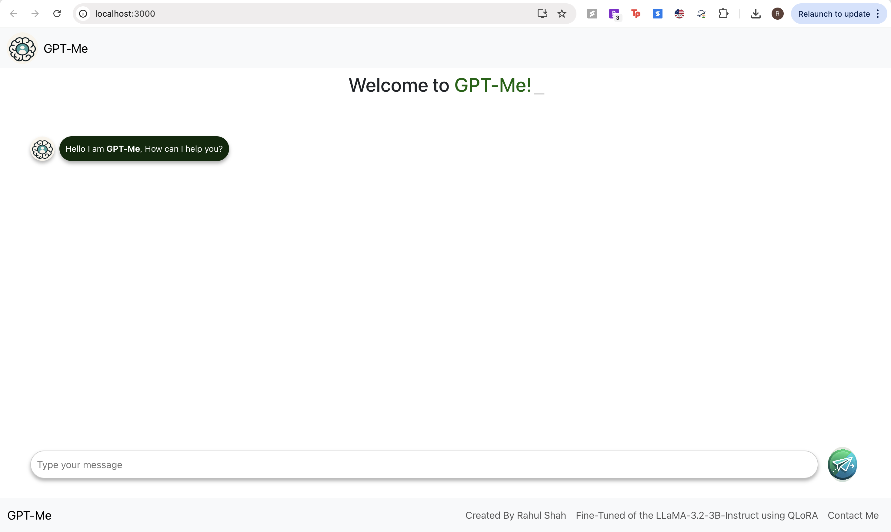

# GPT-Me: Fine-Tuned LLM + React + FastAPI

## Overview

**GPT-Me** is a personalized AI chatbot trained on the professional and academic data of **Rahul Hemal Shah**. This application combines a **React frontend** with a **FastAPI backend**, powered by a **4-bit quantized LLaMA 3.2 3B model** fine-tuned using **LoRA** adapters.

It supports inference through both a **web interface (Gradio)** and a **production-ready API**.

---



---

## 🔧 Tech Stack

- **Frontend**: React (screenshot shown above)
- **Backend**: FastAPI
- **Model**: Meta LLaMA 3.2-3B-Instruct with 4-bit quantization
- **Training**: LoRA using PEFT
- **Serving**: Gradio UI and FastAPI endpoint
- **Tokenizer & Evaluation**: Hugging Face Transformers, Datasets, SentenceTransformers
- **Model Quantization**: `bitsandbytes`
- **Evaluation Metrics**: BLEU, ROUGE, BERTScore, Cosine Similarity

---

## 🧠 Model Training

The model was trained with instruction-tuned data based on Rahul’s:

- Work experience (Spotify, MSI, SLB, etc.)
- Academic background (UMass Amherst, VIT)
- Technical skills & tools
- Projects (SnapScore, StockStream)
- Publications (Drone anomaly detection - Springer)

Training includes:
- Tokenization with custom prompt formatting
- 12 epochs using cosine LR scheduling
- 4-bit quantization for reduced memory footprint
- LoRA adapters for efficient fine-tuning

Saved artifacts:
- `rahul-llama3-gptme-lora` (uploaded to HuggingFace Hub)

---

## 🖥️ Inference API

The application supports two ways to ask questions:

### 1. Gradio Web Interface
Launches a chat-based UI for interactive Q&A.

```python
gr.Interface(fn=chat_with_rahul, inputs="text", outputs="text", title="GPT-Me").launch()
```
### 2. FastAPI Endpoint
POST /ask
```bash
{
  "question": "What did Rahul work on at Spotify?"
}
```


```bash
{
  "answer": "Rahul Hemal Shah developed a multi-agent Text-to-SQL framework..."
}
```

---

## 📊 Evaluation
The generated responses were evaluated using:

- BLEU
- ROUGE-L
- BERTScore (F1)
- Cosine Similarity (Sentence Embeddings)
- Achieved high similarity across metrics when compared to ground-truth references.

---

## 📁 File Structure

```bash
.
├── image.png                # React + FastAPI architecture screenshot
├── app.py                   # FastAPI backend running LoRA on CPU
├── gptme.py                 # Training + Evaluation script
├── requirements.txt         # Dependencies for backend and training

```
---
## 📦 Installation
```bash
pip install -r requirements.txt
```
For development or Gradio inference:
```bash
pip install gradio evaluate nltk bert-score rouge_score sentence-transformers
```
---
## 🤝 Acknowledgements

- Hugging Face for Transformers & model hosting
- Meta AI for LLaMA 3
- PEFT by Hugging Face for LoRA
- bitsandbytes for quantization

---
## 🧑‍💻 About
Built and fine-tuned by Rahul Hemal Shah, a CS grad student at UMass Amherst, currently a Graduate Researcher at Spotify.
